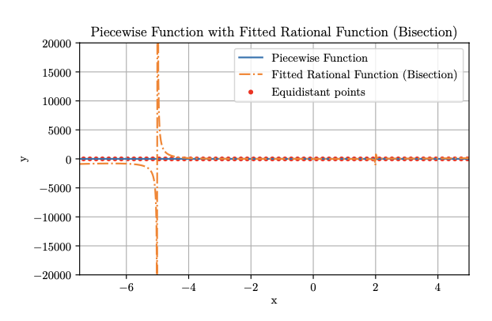
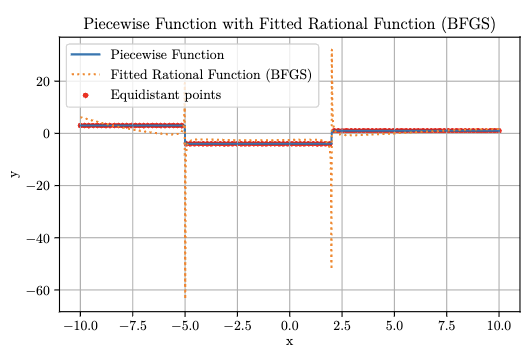

# Rational-Classification

## Optimization Problem

$$
\min_{a_i, b_i} \max_{i=1,\ldots,N} \left| y_i - \frac{p(x_i)}{q(x_i)} \right| = \left| y_i - \frac{\sum_{k=0}^{n} a_n x_{i,1}^{\alpha_1} x_{i,2}^{\alpha_2} }{\sum_{k=0}^{n} b_n x_{i,1}^{\beta_1} x_{i,2}^{\beta_2} } \right|
$$

## One Dimensional Analysis

### Bisection

### BFGS

## Multivariate Analysis

### Bisection

### BFGS

### Convergence Metrics

